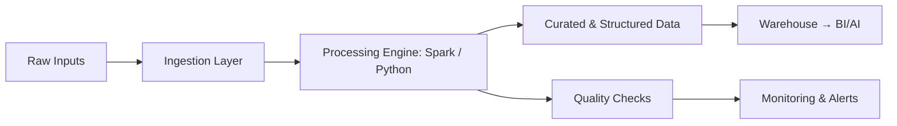

<!-- Global Branding Header -->

  

  
  
  

---

# 🌍 Who I Am — A Multi-Dimensional Engineer

I’m **Anika**, a hybrid of:

- **Systems Engineer**  
- **Data Designer**  
- **AI-Driven Builder**  
- **Toolmaker**

I believe engineering is not just code —  
it's **architecture, precision, clarity, and intent**.

My passion lies in crafting systems and tools that are:

- predictable  
- scalable  
- elegant  
- and impossible to break  

I build with the mindset of someone who wants to leave behind **systems that outlive trends.**

---

# 🧠 My Engineering Philosophy (Signature)

> **"Systems fail when design is weak — not when data is large.  
> My job is to design systems that never fail."**

This philosophy guides every project I build — from simple utilities to full data pipelines.

---

# 🛠️ Technical Skillset — Depth × Breadth

### **Core Engineering**
- ETL Pipelines • Data Modeling • Schema Design  
- Workflow Orchestration • Data Quality Systems  
- Architecture Thinking • Documentation Discipline  

### **Data & Big Data**
- Apache Spark • Kafka • MapReduce Concepts  
- Pandas for Rapid Prototyping  

### **Cloud & Infrastructure**
- AWS → S3, EC2, IAM, Lambda Basics  
- GCP → BigQuery, Cloud Storage, Cloud Functions  

### **Programming & Tools**
- Python • SQL  
- Git • Docker • CI/CD Fundamentals  
- JSON, YAML, APIs, Log Processing  

  
  
  
  
  
  

---

# 🚀 Featured Work — Tools, Systems, Intelligence

### 🔹 **MODZ — Command-Driven Text Intelligence Engine (In Progress)**  
My flagship project: a universal engine that transforms text using human-readable commands.  
The tool combines **automation**, **NLP logic**, and **system design patterns**.  
Will evolve into a **VS Code extension + AI-assisted transformer.**

**Repo:** https://github.com/Anikakumari12/MODZ/tree/master/src

**Tech:** Python, CLI, File Systems, Rule-Based Parsing

---

### 🔹 Clickstream Data Pipeline — User Behavior Analytics
Processes raw clickstream events into clean, analytics-ready datasets for user behavior analysis.
**Repo:** https://github.com/Anikakumari12/Clickstream

---

### 🔹 **Web Scraper — Automated Content Extractor**  
Pulls structured data from web pages and outputs clean, analysis-ready datasets. 

**Repo:** https://github.com/Anikakumari12/simple_web_scraper

---

### 🔹 **JSON → CSV Transformer — Flattening Engine**  
Turns nested JSON into clean CSVs with schema consistency.  
**Repo:** https://github.com/Anikakumari12/json-to-csv-converter

---

### 🔹 **CSV Summary Tool — Instant Profiling Utility**  
Data profiling in one command — missing values, schema, distributions.  
**Repo:** https://github.com/Anikakumari12/csv-summary-tool-v1

---

### 🔹 **Log Analyzer — Pattern Detection Engine**  
Processes unstructured text logs and extracts meaningful patterns.  
**Repo:** https://github.com/Anikakumari12/TextLogAnalyzer

---

# 🧭 System Architecture Mindset

## 📊 GitHub Analytics

  
  

## 🌐 Connect With Me
	•	LinkedIn: https://www.linkedin.com/in/anika-kumari-data-engineer/
	•	Email: anigupta9022@gmail.com

  <i>“Engineering is the architecture of logic — and I’m here to build with precision.”</i>

