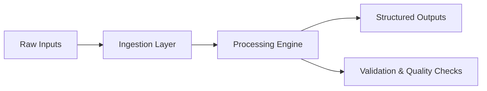

<!-- =======================
     ANIKA KUMARI — README
     ======================= -->

<p align="center">
  
</p>

<p align="center">
  
  
  
</p>

---

## 🌍 About Me

I’m **Anika**, a systems-first data engineer who enjoys working close to reality:

- files before frameworks  
- correctness before scale  
- design before optimization  

I build software that is:

- predictable  
- safe by default  
- easy to reason about  
- hard to misuse  

I care less about trends and more about **engineering decisions that age well**.

---

## 🧠 Engineering Philosophy

> **“Most systems don’t fail because of scale.  
> They fail because the design didn’t respect reality.”**

My approach emphasizes:

- explicit behavior  
- clear failure modes  
- human-readable errors  
- safety before automation  

---

## 🛠 Technical Focus

### Core Engineering
- ETL pipelines & transformations  
- File-based processing systems  
- Validation & defensive programming  
- Command-line tooling  
- Modular system design  

### Data & Big Data
- Apache Spark (concepts & practice)  
- Pandas for transformation logic  
- Schema & data quality thinking  

### Cloud Fundamentals
- AWS: S3, EC2, IAM (basics)  
- GCP: BigQuery, Cloud Storage (concepts)  

### Languages & Tools
- Python  
- SQL  
- Git  
- Linux / CLI  
- JSON, CSV, Logs  

---

## 🧭 How I Think About Systems


---

## 🚀 Projects

### 🔹 MODZ — Command-Line Text Processing Tool

A safety-first CLI tool for predictable text manipulation at scale.

**What it solves**
- Manual editing of large text files
- Risky operations without preview
- Accidental data loss during edits

**Design highlights**
- Preview-before-commit workflow
- Explicit, human-readable commands
- Zero hidden side effects

**Tech**
- Python
- CLI argument parsing
- File I/O
- Safety-first system design

🔗 **Repository**  
https://github.com/Anikakumari12/MODZ

---

### 🔹 Clickstream Data Pipeline — User Behavior Analytics

Transforms raw clickstream events into clean, analytics-ready datasets.

**Highlights**
- Event ingestion and transformation
- Structured outputs for downstream analysis
- Strong focus on data quality and consistency

🔗 **Repository**  
https://github.com/Anikakumari12/Clickstream

---

### 🔹 Web Scraper — Automated Content Extractor

Extracts structured data from web pages into clean CSV outputs.

**Highlights**
- HTML parsing
- Reusable and modular scraping logic

🔗 **Repository**  
https://github.com/Anikakumari12/simple_web_scraper

---

### 🔹 JSON → CSV Transformer — Schema Flattening Tool

Converts nested JSON into flat, analysis-ready CSV files.

**Highlights**
- Handles deeply nested structures
- Preserves schema consistency

🔗 **Repository**  
https://github.com/Anikakumari12/json-to-csv-converter

---

### 🔹 CSV Summary Tool — Instant Data Profiler

Provides quick insights into CSV datasets.

**Highlights**
- Missing value detection
- Schema inspection
- Lightweight profiling

🔗 **Repository**  
https://github.com/Anikakumari12/csv-summary-tool-v1

---

### 🔹 Log Analyzer — Pattern Detection Utility

Extracts meaningful patterns from unstructured log files.

**Highlights**
- Regex-based parsing
- Error and event detection

🔗 **Repository**  
https://github.com/Anikakumari12/TextLogAnalyzer

---

## 📊 GitHub Activity

<p align="center">
  
  
</p>

📫 Connect
	•	LinkedIn: https://www.linkedin.com/in/anika-kumari-data-engineer/
	•	Email: anigupta9022@gmail.com

<p align="center">
  <i>Building systems that are easy to trust.</i>
</p>
```
